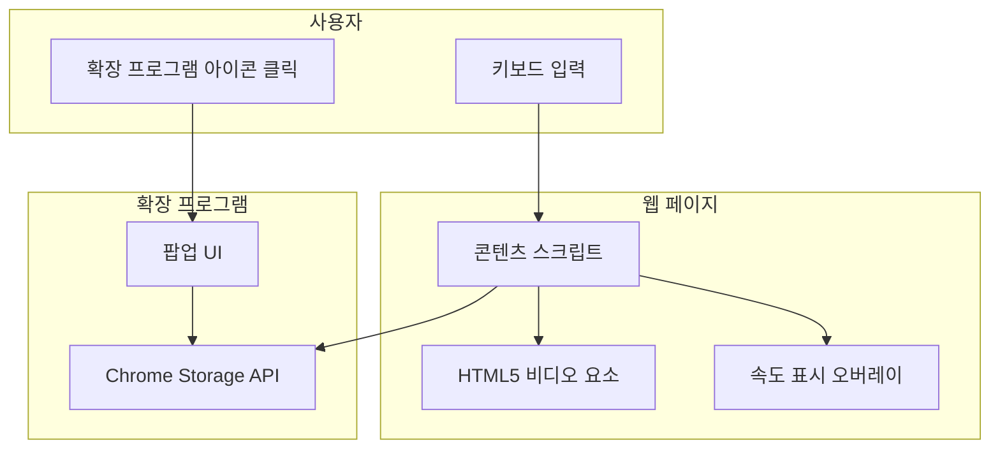

# Technical Requirements Document (TRD)

## 1. Executive Technical Summary
- **Project Overview**: 본 프로젝트는 순수 JavaScript와 Chrome Extension Manifest V3를 사용하여 온라인 학습 플랫폼의 비디오 재생 속도를 키보드 단축키로 정밀하게 제어하는 경량 브라우저 확장 프로그램을 개발하는 것을 목표로 합니다. 아키텍처는 콘텐츠 스크립트, 팝업 UI, 백그라운드 서비스 워커의 세 가지 핵심 구성 요소로 분리하여 각 기능의 독립성과 유지보수성을 확보합니다. 외부 라이브러리 의존성을 최소화하여 성능 저하 없이 신속한 사용자 경험을 제공하는 데 중점을 둡니다.
- **Core Technology Stack**: 프론트엔드 UI는 HTML5와 CSS3로 구성하며, 핵심 로직은 JavaScript (ES6)를 사용합니다. 브라우저 통합은 Chrome Extensions Manifest V3 API를 통해 이루어지며, 사용자 설정 데이터는 Chrome Storage API (`local`)를 이용해 영속적으로 저장합니다.
- **Key Technical Objectives**: 유휴 상태에서 평균 CPU 사용률 1% 미만, 키보드 입력 반응 지연 시간 50ms 미만, 압축된 확장 프로그램 크기 150KB 이하를 목표로 설정합니다. 모든 기능은 외부 네트워크 호출 없이 오프라인 환경에서 완벽하게 동작해야 합니다.
- **Critical Technical Assumptions**: 사용자는 Chrome 또는 Chromium 기반 브라우저를 사용하며, 대상 비디오는 표준 HTML5 `<video>` 요소를 통해 재생된다고 가정합니다. 콘텐츠 스크립트가 모든 웹 페이지(`*://*/*`)에 주입될 수 있는 권한을 사용자가 허용할 것을 전제로 합니다.

## 2. Tech Stack
| Category | Technology / Library | Reasoning (Why it's chosen for this project) |
| :--- | :--- | :--- |
| **핵심 언어** | JavaScript (ES6) | 외부 종속성 없이 브라우저 확장 프로그램의 모든 로직을 구현할 수 있는 가장 직접적이고 가벼운 선택입니다. |
| **UI 마크업/스타일링** | HTML5, CSS3 | 팝업 및 오버레이 UI를 구성하기 위한 웹 표준 기술로, 별도의 프레임워크 없이 간단하고 빠르게 개발할 수 있습니다. |
| **브라우저 통합** | Chrome Extensions Manifest V3 | 최신 Chrome 확장 프로그램 개발 표준으로, 보안 및 성능 요구사항을 충족하며 필수적인 API를 제공합니다. |
| **클라이언트 측 저장소** | Chrome Storage API (`local`) | 사용자의 선호 재생 속도 설정을 브라우저에 안전하고 영속적으로 저장하기 위한 네이티브 API입니다. 동기화가 필요 없는 MVP 요구사항에 적합합니다. |

## 3. System Architecture Design

### Top-Level building blocks
- **콘텐츠 스크립트 (`src/content/*.js`)**
  - 웹 페이지에 직접 주입되어 페이지의 DOM에 접근하고 조작합니다.
  - 하위 구성 요소: `state.js`, `video-controller.js`, `overlay-manager.js`, `video-tracker.js`, `keyboard-handler.js`, `bootstrap.js`.
- **팝업 UI (`popup.html`, `popup.js`)**
  - 사용자가 확장 프로그램 아이콘을 클릭했을 때 나타나는 인터페이스입니다.
  - 하위 구성 요소: 선호 속도 입력을 위한 HTML 폼, 설정 저장을 위한 JavaScript 로직.
- **백그라운드 서비스 워커 (`background.js`)**
  - 확장 프로그램의 생명주기를 관리하고 백그라운드 작업을 처리합니다.
  - 하위 구성 요소: Manifest V3 요구사항을 충족하기 위한 최소한의 이벤트 리스너. (v1.1의 뱃지 텍스트 업데이트 기능 구현 시 메시지 수신 로직 추가)
- **매니페스트 파일 (`manifest.json`)**
  - 확장 프로그램의 모든 설정과 권한을 정의하는 핵심 설정 파일입니다.
  - 하위 구성 요소: 권한(`storage`, `scripting`), 콘텐츠 스크립트 주입 규칙, 팝업 페이지 경로, 백그라운드 서비스 워커 정의.

### Top-Level Component Interaction Diagram


- **키보드 상호작용**: 사용자가 단축키를 누르면, 웹 페이지에 주입된 **콘텐츠 스크립트**가 이벤트를 감지하여 **HTML5 비디오 요소**의 재생 속도를 직접 변경하고 **속도 표시 오버레이**를 화면에 노출합니다.
- **설정 변경**: 사용자가 **확장 프로그램 아이콘**을 클릭하면 **팝업 UI**가 열립니다. 사용자가 선호 속도를 입력하고 저장하면, **팝업 UI**는 이 값을 **Chrome Storage API**에 기록합니다.
- **데이터 동기화**: **콘텐츠 스크립트**는 '선호 속도로 전환' 기능(r키)을 실행할 때 **Chrome Storage API**에서 저장된 값을 읽어와 사용합니다.

### Code Organization & Convention
**Domain-Driven Organization Strategy**
- **Domain Separation**: 코드를 기능 도메인(`video_control`, `ui`, `storage`)을 중심으로 구성하여 각 책임 영역을 명확히 분리합니다.
- **Layer-Based Architecture**: 확장 프로그램의 구성 요소(콘텐츠 스크립트, 팝업, 백그라운드)를 명확한 계층으로 분리하여 상호 의존성을 최소화합니다.
- **Feature-Based Modules**: 각 도메인 내에서 관련된 기능(예: 키보드 리스너, 오버레이 관리)을 모듈 단위로 그룹화합니다.
- **Shared Components**: 본 프로젝트의 규모가 작으므로, 별도의 공유 모듈보다는 각 스크립트 내에서 필요한 유틸리티 함수를 정의하여 단순성을 유지합니다.

**Universal File & Folder Structure**
``` 
/
├── manifest.json
├── icons/
│   ├── icon16.png
│   ├── icon48.png
│   └── icon128.png
├── src/
│   ├── shared/
│   │   ├── config.js
│   │   ├── messages.js
│   │   └── storage.js
│   ├── content/
│   │   ├── state.js
│   │   ├── video-controller.js
│   │   ├── overlay-manager.js
│   │   ├── video-tracker.js
│   │   ├── keyboard-handler.js
│   │   └── bootstrap.js
│   ├── popup/
│   │   ├── popup.html
│   │   ├── popup.js
│   │   └── popup.css
│   └── background/
│       └── background.js
└── README.md
```

### Data Flow & Communication Patterns
- **Client-Server Communication**: 해당 없음. 본 확장 프로그램은 외부 네트워크 통신을 하지 않습니다.
- **Database Interaction**: `chrome.storage.local` API를 사용하여 비동기적으로 `get` 및 `set` 메서드를 호출합니다. 데이터는 key-value 쌍(예: `{'preferredSpeed': 1.8}`)으로 저장됩니다.
- **External Service Integration**: 해당 없음.
- **Real-time Communication**: 해당 없음.
- **Data Synchronization**:
- **팝업 -> 저장소**: `popup.js`에서 사용자가 선호 속도를 저장하면 `storage.js`를 통해 `chrome.storage.set()`이 호출됩니다.
- **콘텐츠 스크립트 <- 저장소**: `bootstrap.js`는 초기화 시 `storage.js`를 통해 저장된 선호 속도를 읽고, 변경 이벤트를 구독합니다.

## 4. Performance & Optimization Strategy
- **효율적인 이벤트 리스너 관리**: 키보드 이벤트 리스너는 페이지 내에 `<video>` 요소가 존재할 경우에만 활성화하여 불필요한 자원 소모를 방지합니다. 또한, 비디오 요소가 포커스되지 않았을 때는 이벤트를 처리하지 않고 통과시켜 사이트 고유 단축키와의 충돌을 최소화합니다.
- **최소한의 DOM 조작**: 속도 표시 오버레이는 한 번 생성된 후, 내용을 변경하고 `opacity`와 `visibility` 속성을 조절하는 방식으로 재사용합니다. `setTimeout`을 이용해 일정 시간 후 자동으로 숨겨지도록 하여 지속적인 렌더링 부하를 피합니다.
- **경량 스크립트 유지**: 외부 라이브러리나 프레임워크를 사용하지 않고 순수 JavaScript로만 구현하여 확장 프로그램의 전체 크기와 메모리 사용량을 최소화합니다. 코드 실행 속도를 높이고 초기 로딩 시간을 단축합니다.
- **비동기 작업 최적화**: `Chrome Storage API` 호출은 비동기적으로 처리되므로, `async/await` 또는 Promise를 사용하여 UI 블로킹 없이 데이터를 읽고 쓸 수 있도록 구현합니다.

## 5. Implementation Roadmap & Milestones
### Phase 1: Foundation (MVP Implementation)
- **Core Infrastructure**: `manifest.json` 설정(권한, 콘텐츠 스크립트, 팝업 정의 포함), 기본 폴더 구조 생성.
- **Essential Features**: 콘텐츠 스크립트 내 키보드 이벤트 리스너 구현(',' , '.' , 'r' 키). HTML5 비디오 요소의 `playbackRate` 제어 로직 개발. 속도 변경 시 화면 우측 상단에 오버레이 표시 및 자동 숨김 기능 구현. 팝업 UI를 통해 선호 속도 값을 `chrome.storage.local`에 저장하는 기능 구현.
- **Basic Security**: 콘텐츠 스크립트가 페이지의 다른 스크립트와 격리되어 실행되도록 보장.
- **Development Setup**: 로컬 환경에서 압축 해제된 확장 프로그램을 로드하고 테스트하는 개발 환경 구축.
- **Timeline**: 6주

### Phase 2: Feature Enhancement
- **Advanced Features**: 팝업 UI에서 선호 속도를 변경할 때, 열려 있는 탭의 비디오 속도에 실시간으로 반영하는 기능 추가. 속도 변경 시 확장 프로그램 아이콘의 뱃지 텍스트에 현재 속도를 잠시 표시하는 기능 구현.
- **Performance Optimization**: MVP 구현 후 주요 학습 사이트에서 성능을 측정하고, 병목 현상 발생 시 코드 리팩토링 진행.
- **Enhanced Security**: 코드 검토를 통해 잠재적인 보안 취약점(예: DOM-based XSS)을 점검하고 보완.
- **Monitoring Implementation**: (해당 없음. 개인용 프로젝트)
- **Timeline**: MVP 완료 후 2주

## 6. Risk Assessment & Mitigation Strategies
### Technical Risk Analysis
- **Technology Risks**: 일부 웹사이트는 커스텀 비디오 플레이어나 Shadow DOM을 사용하여 표준 `<video>` 요소 접근을 어렵게 할 수 있습니다.
  - **Mitigation Strategies**: `document.querySelector('video')` 외에 Shadow DOM 내부를 탐색하는 로직을 추가하고, 여러 사이트에서 사용되는 공통적인 플레이어 구조를 분석하여 탐색 로직을 고도화합니다.
- **Performance Risks**: 비디오가 많은 페이지나 저사양 컴퓨터에서 콘텐츠 스크립트의 이벤트 리스너가 성능 저하를 유발할 수 있습니다.
  - **Mitigation Strategies**: 이벤트 리스너에 디바운싱(debouncing)을 적용하여 과도한 실행을 방지하고, 활성화된 비디오 요소에만 리스너의 로직이 동작하도록 범위를 제한합니다.
- **Security Risks**: 웹 페이지의 CSP(Content Security Policy)가 스크립트 주입이나 특정 DOM 조작을 차단할 수 있습니다.
  - **Mitigation Strategies**: Manifest V3의 정책을 준수하고, 인라인 스크립트나 `eval()` 사용을 완전히 배제합니다. 오버레이 UI 스타일링은 인라인 스타일 대신 별도의 CSS 파일을 통해 주입하여 CSP 제한을 우회합니다.
- **Integration Risks**: 브라우저 업데이트로 인해 Chrome API 동작이 변경되어 확장 프로그램이 오작동할 수 있습니다.
  - **Mitigation Strategies**: 특정 API 버전에 대한 의존성을 최소화하고, Chrome 개발자 문서를 주기적으로 확인하며 주요 변경 사항에 대응할 수 있도록 코드를 유연하게 작성합니다.

### Project Delivery Risks
- **Timeline Risks**: 다양한 웹사이트에서의 호환성 테스트가 예상보다 많은 시간을 소요할 수 있습니다.
  - **Mitigation Strategies**: MVP 단계에서는 가장 많이 사용되는 3~5개의 주요 온라인 학습 플랫폼(예: YouTube, Udemy, Coursera)에 대한 테스트에 집중하고, 이후 점진적으로 지원 범위를 넓힙니다.
- **Resource Risks**: (해당 없음. 개인 프로젝트)
- **Quality Risks**: 단축키가 특정 웹사이트의 기존 단축키와 충돌하여 사용성을 해칠 수 있습니다.
  - **Mitigation Strategies**: 팝업 UI에 확장 프로그램의 전체 기능을 켜고 끌 수 있는 토글 스위치를 추가하여 사용자가 필요에 따라 쉽게 비활성화할 수 있도록 합니다.
- **Deployment Risks**: Chrome 웹 스토어 검수 과정에서 예기치 않은 사유로 등록이 거부될 수 있습니다.
  - **Mitigation Strategies**: 제출 전 Chrome 웹 스토어 정책을 철저히 검토하고, 요청하는 권한(`storage`, `scripting`)의 사용 목적을 명확하게 기술합니다. 코드 난독화를 피하고 가독성 높은 코드를 제출하여 검수 과정을 원활하게 합니다.
